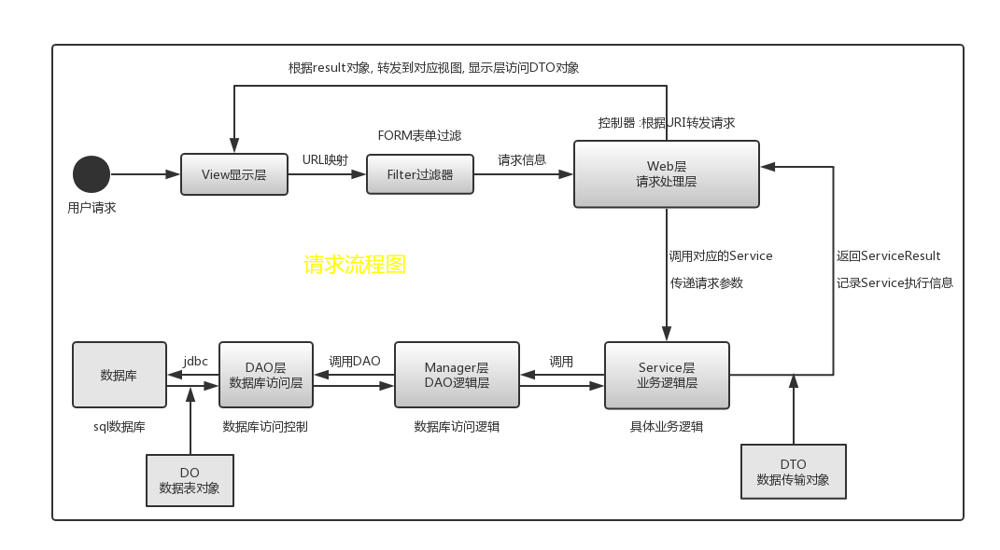

README -- LifeCat
===========================
|title|content|
|:---:|:---:
|desc|智能成长相册网站lifecat
|author|ten
|version|Version 2
|date|2018-05
|brief|基于MVC的Javaweb网站开发
******************************************************************************
 #### _@访问链接_  
  * [官网主页](http://47.106.11.84)
  
  
  * [相册主页](http://www.lifecat.club:8080/lifecatweb)
  
  
******************************************************************************
 #### _@使用技术_
  
  |title|content|
  |---|---
  |前端|Html CSS JavaScript
  |前端框架|bootstrap jQuery
  |后端|jsp servlet jdbc
  |后端框架|MVC SOA 
  |设计模式|构建者模式 静态工厂模式 单例模式
  |项目管理|maven
  |单元测试|Junit4
  |日志框架|slf4j
  |数据库|MySql-mariadb
******************************************************************************
 #### _@Web目录_
  * webapp
    * __include__
      * homePage.jsp     // 用户主页body内容部件
      * footer.jsp       // 页脚部件
      * header.jsp       // 页眉部件
      * top.jsp          // 页面标题栏部件
    * __WEB-INF__
      * imageshow.jsp    // 用户图片展示界面
      * imageshow2.jsp   // 用户分类图片展示界面
      * updiary.jsp      // 上传日记
      * upimage.jsp      // 上传图片
      * userhome.jsp     // 用户主页
    * __index.jsp__      // 登录/注册界面
******************************************************************************
 #### _@Java目录_
  * src
    * main.java.com.wang
        * __openfunc__      
        // 开放接口层 :接收Android端HTTP请求, 并返回请求结果
        * __doo__           
        // DO包 :对应于数据库表结构, POJO类型
        * __dto__           
        // DTO包 :数据传输对象, 对应逻辑实体，采用构建者模式 或 工厂模式
        * __dao__           
        // DAO协议层 :定义了DAO层的协议, 接口层, 通过静态工厂获取
        * __daoimpl__           
        // DAO实现层 :通过具体实现, 执行数据库交互, 本例中实现了jdbc形式
        * __manager__       
        // Manager层 :DAO层的抽象逻辑操作, Manager层通过静态工厂获取
        * __filter__        
        // Filter过滤器 :对所有请求执行Encoding过滤, 对*.do请求执行Form表单过滤
        * __form__         
        // Form表单验证 :对相应表单执行过滤, 确保格式编码等, 返回Result
        * __exfunc__       
        // 外部接口 :通过java call shell方式, 调用本地python脚本, 执行机器学习操作
        * __controller__   
        // Web层 :通过请求内容, 调用相应Service, 转发到Service并获取返回结果
        * __service__       
        //Service层 :执行具体业务逻辑, 并且通过try-catch处理底层抛出异常, 传输DTO到表现层
        * __util__         
        // 工具类 :包括时间类, 连接类, 图片写入操作, 主机配置等
        * __action__
        // 安全目录WEB-INF转发机制
    * test.java.com.wang
        * Test          
        // 单元测试
*******************************************************************************
 #### _@应用分层_  
  
   * 上层依赖于下层                               
   * 箭头关系表示可直接依赖  
     
     * 1.__开放接口层__: (openfunc包)  
        * 可直接封装Service方法暴露成RPC接口;  
        * 通过web封装成HTTP接口, 可进行远程调用  
     * 1.__终端显示层__: (web包)  
        * MVC-表现层: 模板渲染层, 主要是JSP渲染  
     * 2.__Web层__: (controller包-ActionServlet)
        * MVC-控制器层: 负责转发请求
        * 对访问控制进行转发, 对各类基本参数校验
     * 3.__Service层__: (service包-<Service>接口)
        * MVC-模型层: 处理抽象业务逻辑， 具体的业务逻辑服务层
        * 对request对象进行处理和转发
     * 4.__Manager层__: (manager包-<Manager>接口)
        * DAO逻辑层, 接收DO对象, 调用DAO层对DO执行具体操作
        * 对service层的下沉处理: 抽象业务逻辑->抽象DAO逻辑
     * 5.__DAO层__: (dao包-<DAO>接口)
        * 对Manager层的下沉处理: 抽象DAO逻辑->具体DAO操作
        * DAOImpl层为具体实现类, 执行具体jdbc操作, 进行数据库交互
     * 6.__外部接口层__: (exfunc包)
        * 调用外部python接口, 实现机器学习的操作
     * 以上调用的返回类型 Result接口
  ******************************************************************************
 #### _@请求流程分析_
   
******************************************************************************
## 文档目录
  * __[项目规范](Read/standard.md)__ 
  * __[版本控制](Read/version.md)__
  * __[数据库设计](Read/database.md)__
  * __[数据库sql设计](Read/sql.md)__
  * __[分层架构设计](#_@应用分层_)__  
   
    * [View层终端显示层设计](Read/view.md)
    * [Filter层请求过滤器设计](Read/filter.md)
    * [Form层表单过滤组件层设计](Read/form.md)
    * [Web层请求处理层设计](Read/web.md)
    * [Service层业务逻辑层设计](Read/service.md)
    * [Manager层通用处理层设计](Read/manager.md)
    * [Pojo数据对象模型设计](Read/bean.md)
    * [Utils工具类设计](Read/utils.md)
    * [Constant常量类设计](Read/constant.md)
    * [Exfunc外部接口层设计](Read/exfunc.md)
    * [Openfunc开放接口层设计](Read/openfunc.md)
    
******************************************************************************
### 界面展示

