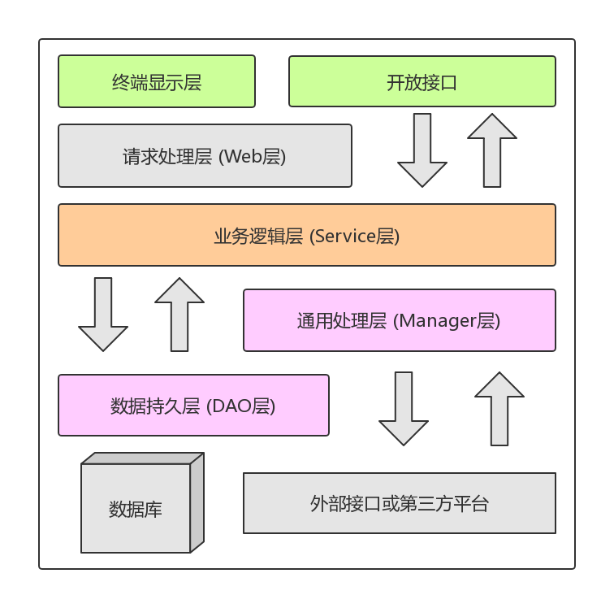

README
===========================
|title|content|
|---|---
|desc|智能成长相册网站lifecat
|author|ten
|version|Version 2
|date|2018-05
|brief|基于MVC的Javaweb网站开发
******************************************************************************
  _@访问链接_  
  * [官网主页](http://47.106.11.84)
  * [相册主页](http://www.lifecat.club:8080/lifecatweb)
******************************************************************************
  _@使用技术_
  
  |title|content|
  |---|---
  |前端|Html CSS JavaScript
  |前端框架|bootstrap jQuery
  |后端|jsp servlet jdbc
  |后端框架|MVC SOA 
  |设计模式|构建者模式 静态工厂模式 单例模式
  |项目管理|maven
  |单元测试|Junit4
  |日志框架|slf4j
  |数据库|MySql-mariadb
******************************************************************************
  _@Web目录_
  * webapp
    * include
      * home
        * homePage.jsp   // 用户主页body内容部件
      * footer.jsp       // 页脚部件
      * header.jsp       // 页眉部件
      * top.jsp          // 页面标题栏部件
    * WEB-INF
      * imageshow.jsp    // 用户图片展示界面
      * imageshow2.jsp   // 用户分类图片展示界面
      * updiary.jsp      // 上传日记
      * upimage.jsp      // 上传图片
      * userhome.jsp     // 用户主页
    * index.jsp          // 登录/注册界面
******************************************************************************
  _@Java目录_
  * src
    * main.java.com.wang
        * __openfunc__      
        //开放接口层 :接收Android端HTTP请求, 并返回请求结果
        * __doo__           
        //DO包 :对应于数据库表结构, POJO类型
        * __dto__           
        //DTO包 :数据传输对象, 对应逻辑实体，采用构建者模式 或 工厂模式
        * __dao__           
        //DAO协议层 :定义了DAO层的协议, 接口层, 通过静态工厂获取
        * __daoimpl__           
        //DAO实现层 :通过具体实现, 执行数据库交互, 本例中实现了jdbc形式
        * __manager__       
        //Manager层 :DAO层的抽象逻辑操作, Manager层通过静态工厂获取
        * __filter__        
        //Filter过滤器 :对所有请求执行Encoding过滤, 对*.do请求执行Form表单过滤
        * __form__         
        //Form表单验证 :对相应表单执行过滤, 确保格式编码等, 返回Result
        * __exfunc__       
        //外部接口 :通过java call shell方式, 调用本地python脚本, 执行机器学习操作
        * __controller__   
        //Web层 :通过请求内容, 调用相应Service, 转发到Service并获取返回结果
        * __service__       
        //Service层 :执行具体业务逻辑, 并且通过try-catch处理底层抛出异常, 传输DTO到表现层
        * __util__         
        //工具类 :包括时间类, 连接类, 图片写入操作, 主机配置等
    * test.java.com.wang
        * Test          
        //单元测试
*******************************************************************************
  _@应用分层_  
  
   * 上层依赖于下层                               
   * 箭头关系表示可直接依赖  
     
     * 1.__开放接口层__: (openfunc包)  
        * 可直接封装Service方法暴露成RPC接口;  
        * 通过web封装成HTTP接口, 可进行远程调用  
     * 1.__终端显示层__: (web包)  
        * MVC-表现层: 模板渲染层, 主要是JSP渲染  
     * 2.__Web层__: (controller包-ActionServlet)
        * MVC-控制器层: 负责转发请求
        * 对访问控制进行转发, 对各类基本参数校验
     * 3.__Service层__: (service包-<Service>接口)
        * MVC-模型层: 处理抽象业务逻辑， 具体的业务逻辑服务层
        * 对request对象进行处理和转发
     * 4.__Manager层__: (manager包-<Manager>接口)
        * DAO逻辑层, 接收DO对象, 调用DAO层对DO执行具体操作
        * 对service层的下沉处理: 抽象业务逻辑->抽象DAO逻辑
     * 5.__DAO层__: (dao包-<DAO>接口)
        * 对Manager层的下沉处理: 抽象DAO逻辑->具体DAO操作
        * DAOImpl层为具体实现类, 执行具体jdbc操作, 进行数据库交互
     * 6.__外部接口层__: (exfunc包)
        * 调用外部python接口, 实现机器学习的操作
     * 以上调用的返回类型 Result接口
  ******************************************************************************
  _@请求流程分析_
   
******************************************************************************
## 文档目录
  * __[项目规范](#项目规范)__ 
    * [文档说明](#文档说明)
    * [编程规约](#编程规约)
      * [命名风格](#命名风格)
      * [常量定义](#常量定义)
      * [代码格式](#代码格式)
      * [OOP规范](#OOP规范)
      * [控制语句](#控制语句)
      * [注释规约](#注释规约)
    * [Java特性规约](#)
      * [集合处理](#集合处理)
      * [并发处理](#并发处理)
    * [异常规范](#异常规范)
      * [分层异常处理](#分层异常处理)
      * [异常处理](#异常处理)
    * [日志规约](#日志规约)
      * [日志规约](#日志规约)
    * [版本管理](#版本管理)
    * [数据库分析](#数据库分析)
      * [数据库范式](#数据库范式)
      * [建表规约](#建表规约)
      * [索引规范](#索引规范)
      * [SQL语句](#SQL语句)
      * [ORM映射](#ORM映射)
  * __[分层架构设计](#分层架构设计)__  
    * [DB层](#DB层)
      * [数据库关系设计](#数据库关系设计)
      * [数据库模块设计](#数据库模块设计)
      * [数据库表设计](#数据库表设计)
    * [View层终端显示层设计](#view层终端显示层设计)
    * [Filter层请求过滤器设计](#filter层请求过滤器设计)
    * [Form层表单过滤组件层设计](#form层表单过滤组件层设计 )
    * [Web层请求处理层设计](#web层请求处理层设计)
    * [Service层业务逻辑层设计](#service层业务逻辑层设计)
    * [Manager层通用处理层设计](#manager层)
    * [DAO层数据持久层设计](#dao层数据持久层设计)
    * [DTO数据传输对象设计](#dto数据传输对象设计)
    * [DO数据访 问对象设计](#do数据访问对象设计)
    * [Utils工具类设计](#utils工具类设计)
    * [Constant常量类设计](#constant常量类设计)
    * [Exfunc外部接口层设计](#exfunc外部接口层设计)
    * [Openfunc开放接口层设计](#openfunc开放接口层设计)
******************************************************************************
## 项目规范
[回到顶部](#readme)  
******************************************************************************
### 文档说明
[回到顶部](#readme)  

《Java开发手册》标记说明
* √ :项目中使用并遵循  
* × :未使用规范  
* ? :项目未使用或存疑  
* ! :重要  
* ps:补充  
--------------------------------------------------------------------------------
《Effective Java》标记说明
* 第x条 XXXXX
********************************************************************************
### 编程规约:
[回到顶部](#readme)  
#### 命名风格
    * √ 1 :不以下划线或美元符号开始和结束
    * √ 2 :不使用中英文混合方式，不允许使用中文，除非通用的拼音，如alibaba
    * √ 3 :类名使用UpperCamelClass 但DO/BO/DTO/VO/AO/PO等除外
    * √!4 :方法名、参数名、变量名使用lowerCamelCase风格，必须遵循驼峰形式，包括POJO类型
    * √ 5 :常量命名全部大写，单词间用下划线隔开，不要嫌名字长
    * √!6 :抽象类命名使用Abstract或Base开头
           异常类使用Exception结尾
           测试类使用 类名Test
    * √ 7 :int[] array 括号位置
    * √!8 :POJO类型布尔变量不要加is前缀，否则会引起部分框架解析序列化错误
    * √ 9 :包名统一采用小写，包名采用单数形式  
           若类名有复数含义，类名可使用复数形式
    * √ 10:杜绝不规范的缩写，保持可读性
    * √ 11:使用尽量完整的单词组合来表达其意
    * √!12:若使用了设计模式，应该在命名是体现出设计模式，如Factory,Proxy,Observer
    * √ 13:接口类中的方法和属性不要加修饰符号（如public），并加上有效的Javadoc注释，尽量不要在接口定义变量
    
    * !!14:【面向接口编程】
           对于Service和DAO类，基于SOA的理念，暴露出来的服务一定是接口
           内部实现类用Impl后缀与接口区别
               
    * √ ps:如果形容能力的接口，取对应的形容词（通常是-able）形式为接口名
    * √ 15:枚举类名使用Enum后缀，成员名使用大写加下划线
       
    * !!16:各层命名规约：
         1)Service/DAO层命名规约
         * 获取单个对象的方法-get 前缀
         * 获取多个对象的方法-list 前缀
         * 获取统计值的方法-count 前缀
         * 插入的方法-save / insert 前缀
         * 删除的方法-remove / delete 前缀
         * 修改的方法-update 前缀
         2)领域模型命名规约
         * 数据对象 xxxDO xxx为数据表名
         * 数据传输对象 xxxDTO xxx为业务领域相关的名称
         * 展示对象 xxxVO xxx为网页名称
         * POJO是DO/DTO/VO/BO 统称，禁止命名为xxxPOJO
#### 常量定义
    * √ 1 :不允许使用魔法值（未预先定义的常量）  如反例：String key="lifecat"+userid;    
    * √ 2 :long或Long初始赋值，使用大写L，如反例Long a = 2l , 无法区分l跟1    
    * √ 3 :不要使用一个常量类维护所有常量，要按常量功能进行归类，分开维护
           大而全的常量类，需要查找定位，不利于理解和维护，如HOST配置信息不要放在一个类中    
    * √ 4 :常量的复用层次5层：放置在对应目录的constant目录下。类内直接private static final    
    * √ 5 :如果变量仅在一个范围内变化，使用enum类型
#### 代码格式
    * √ 1 :大括号：若空，写成{}；左前不换行，左后右前换行，else不换行
    * √ 2 :括号和内部字符不空格       
    * √ 3 :if/for/while/switch/do 等保留字和括号之间空格
    * √ 4 :二目三目运算符左右加空格
    * √ 5 :采用4空格，不用tap       
    * √!6 :注释双斜线加空格 // 注释 
    * √!7 :单行字符不超过120，第二行缩进4空格，第三行开始不再缩进
           运算符与下文一起换行
           方法点符号与下文一起换行
           参数换行时，在逗号后进行
           在括号前不换行
    * √ 8 :方法参数，逗号后边必须加空格 (int a, int b)
    * √ 9 :换行符使用unix格式，不要使用Windows格式
    * √ 10:无需增加空格使上下文对齐       
    * √ 11:不同逻辑、不同语义、不同业务之间的代码插入一个空行     
#### OOP规范
    * √!1 :静态变量或静态方法，直接使用类名访问，生成类对象会增加成本              
    * √ 2 :所有覆写方法，必须加@override              
    * √ 3 :避免使用可变参数，避免使用Object参数
    * ? 4 :接口过时，必须使用@Deprecated注解，并说明新接口              
    * ? 5 :不能使用过时类或方法              
    * √ 6 :equals()方法易产生NPE异常    正例 "test".equals(obj)              
           应使用有值得对象来调用方法     反例 obj.equals("test")
    * √!7 :包装类对象进行比较，必须使用equals()，而不是==
           如Integer在（-128~127）直接从缓存取值，可以用==；若超出，在堆上产生，不能用==              
    * !!8 :POJO类型必须使用包装数据类型----数据查询结果可能为NULL，当自动拆箱可能有NPE风险
           RPC方法返回值和参数必须使用包装数据类型--调用失败返回默认值Int->0,Integer->null可表示额外信息
           所有局部变量使用基本数据类型           
    * √!9 :DO/DTO/VO等POJO类型，不要设定任何属性默认值              
    * ? 10:序列化相关 ?              
    * √!11:构造方法禁止加入任何业务逻辑，若有，则放在init()中              
    * √!12:POJO类型必须写toString()方法，若有继承，先调用super.toString()
    * √ 13:String.split()最后一个元素可能NULL 如"1,2,3,,"              
    * √ 14:同名方法放一起
    * √!15:类内方法定义顺序: 公有或保护方法 > 私有方法 > getter/setter              
    * √ 16:setter中，参数名称与成员变量名字一直，this.成员=变量
           getter/setter中，不要加入业务逻辑，会难以排查问题              
    * √ 17:循环体内，使用stringbulider的append方法
    * √!18:final使用情况：
           不允许被继承的类       如String
           不允许修改引用的域对象  如POJO的域变量
           不允许被重写的方法     如POJO的setter
           不允许运行过程中重新赋值的局部变量
           避免上下文使用同一个变量，可使用final强制重新定义一个变量
    * √ 19:慎用object.clone()拷贝
    * !!20:【严控访问范围】                     
           不允许外部直接new，构造方法private
           工具类不允许有public或default构造方法
           类非static成员变量，并且与子类共享，protected
           类非static成员变量，并且只在本类使用，private
           类static成员变量，只在本类使用，private
           static成员变量，必须考虑是否为final
           类成员方法只供类内部调用，必须是private
           类成员方法只对继承类公开，protected
#### 控制语句
    * √ 1 ;switch-case必须有break或return，必须有一个default块
    * √ 2 :单行代码也要有大括号
    * √!3 :高并发中，避免使用等于作为判断，可能导致击穿，应使用范围判断
    * √!4 :避免使用if-else进行判断，不要超过三层
           可以使用卫语句
           策略模式
           状态模式
    * √ 5 :不要在条件判断中执行复杂语句，可以赋给一个布尔变量，取个理解的名字
    * √ 6 :定义对象、获取数据库连接、try-catch，放在循环体外面
    * √ 7 :避免采用取反逻辑
    * ? 8 :接口入参保护 ？
    * √ 9 :需要进行参数检验：
           调用频次低的方法
           执行时间开销大的方法
           需要高稳定性与可用性的方法
           对外提供的接口
           敏感权限入口
    * √ 10:不需要进行参数检验
           被循环调用的方法
           靠近底层的方法，如DAO，应在高层检验
           private只被自己调用的方法，若传入参数确定不会有问题
#### 注释规约
    * √ 1 :类、类属性、类方法使用Javadoc规范，不得使用//
    * √ 2 :抽象方法、接口方法，必须用Javadoc注释
           说明返回值、参数、异常、功能等
    * √ 3 :类必须添加创建者和创建日期
    * √ 4 :方法内部单行注释，在上方// ，多行注释 使用/* */
    * √ 5 :枚举类型字段要有注释
    * √ 6 :英文说不清楚，不如用中文
    * √ 7 :修改代码时，要一起修改注释
    * √ 8 :若注释掉代码，说明原因
    * √ 9 :注释要明确，描述思路
    * √ 10:力求精简准确，语义清晰就不用注释了
    * √ 11:特殊注释   // TODO:(标记人，标记时间，预计处理时间)实际上是Javadoc标签
                    // FIXME:(标记人，标记时间，预计处理时间)错误，不能工作
******************************************************************************
### Java特性规约
[回到顶部](#readme)  
#### 集合处理  
    * √ 1 :只要重写equals()，必须重写hashCode()
           Set存储不重复对象，必须重写
#### 并发处理
    * √ 1 :获取单例对象需要保证线程安全，其中的方法也要保证，如采用双重加锁机制
******************************************************************************
### 异常规范
[回到顶部](#readme)  
#### 分层异常处理
* DAO层: 抛出细粒度异常
* Manager层: 使用catch(Exception e)捕获所有异常, 并throw new DAOException(e), 不需打印日志
* Service层: 捕获异常, 记录日志, 不可再向上抛出, 并进行错误页面处理
#### 异常处理 
    * √ 1 :能通过检查避免的运行时异常，要进行预检查
    * √ 2 :异常不要用来做流程控制、条件控制
    * √ 3 :catch分清稳定代码与非稳定代码，不要对大段无异常代码进行try-catch
    * √ 4 :捕获异常是为了处理它，不要什么都不做，那么请将它抛出到外层调用者
    * ? 5 :try中若有事务代码，catch后要回滚事务，rollback
    * √ 6 :finally对资源进行关闭
      ?    try-with-resources方式 ?
    * √!7 :finally中不能用return trt(return)-->finally 若存在，则try中的return被覆盖掉
    * √ 8 :捕获异常与抛出异常必须完全匹配，或捕获其父类
    * √!9 :方法的返回值可以为null，不强制返回空集合或者空对象等，必须添加注释说明什么情况下返回Null
    * √!ps:NPE是调用者的责任，即使被调用者返回空集合或空对象，也并非高枕无忧，也要判断NPE
    * √ 10:NPE: 必须检查NPE问题，可能各种情况都会导致NPE问题
    * ?!11:避免直接抛出运行时异常，推荐业界定义过的异常如 DAOException、ServiceException
           不允许直接抛出Exception或Throwable
    * √ 12:考虑使用Result方式，封装isSuccess()方法、“错误码”、“错误简短信息”
    * √ 13:避免出现重复代码，若修改，需修改所有副本，容易遗漏
              抽取共性方法，或者抽象公共类，或者将代码组件化
******************************************************************************
### 日志规约
[回到顶部](#readme)  
#### 日志规约 
    * √ 1 :不可直接使用日志系统log4j等的API，应依赖使用日志框架SLF4J
           import org.slf4j.Logger;
           import org.slf4j.LogerFactory
           private static final Logger logger = LoggerFactory.getLogger(this.class);
    * √ 2 :日志文件推荐至少保存15天，避免周频次的异常
    * ? 3 :拓展日志 ?
    * √!4 :对debug/info级别的日志输出，必须使用条件输出形式或占位符方式
           当级别不够时，若logger.info("1"+"2"...)仍然会进行拼接，浪费资源
           条件  :if(logger.isDebugEnabled()){输出}
           占位符 :logger.debug("aehwio{}",值)
    * ? 5 :避免重复打印日志，浪费磁盘资源，应设置 additivity=false
    * ? 6 :logger.success(参数对象 toString() + e.getMessage())
    * √!7 :生产环境禁止输出debug
           有选择输出info
           思考：这些日志真的有人看吗？这条日志能干什么？能解决问题吗？
    * √ 8 :可以使用warn记录用户参数输入错误，避免投诉
           error级别只记录系统逻辑出错，异常等重要信息
******************************************************************************  
### 版本管理
[回到顶部](#readme)  
* __version1.1__  
    * 添加了slf4j-logger  
    * 添加了图片读取功能  
    * 修改了常量类  
* __version1.2__  
    * 添加了智能分类页面-imageshow2.jsp 
    * 修复了bug  
* __version1.3.1__  
    * 单例模式重构MyDate  
    * 构建器模式重构Bean-DTO  
    * 重写了User的hashCode计算,Image的hashCode计算  
    * 覆盖了bean类型的tostring方法  
* __version1.3.2__  
    * 实现了comparable接口，进行日期的比较
    * HOST实现了标记接口  
    * 重构了DAO的SQL查询(单条查询->多条查询)  
* __version1.4__  
    * 设计方法签名  
    * 参数检查  
    * 枚举类改进  
* __version1.5__
    * 增加了Junit测试
* TODO...
******************************************************************************
### 数据库分析
[回到顶部](#readme)  
#### 数据库范式
    1NF - First Normal Form 符合1NF的关系中的每个属性都是原子的不可再分。
    2NF - Second Normal Form 满足1NF，数据库表中的每列都完全依赖于主键。
    3NF - Third Normal Form 满足2NF，要求一个数据库表中不包含已在其它表中已包含的非主关键字信息。
    BCNF - Boyce–Codd Normal Form 满足3NF，主属性内部不能部分或传递依赖
#### 建表规约
    * √ 1 :字段若非负，必须是unsigned
    * √ 1 :表达是否概念，必须使用is_xxx方式，数据类型为unsigned tinyint(1是，0否)
    * √ 2 :数据库名、表名、字段名必须使用小写, mysql在linux下区分大小写
    * √ 3 :表名使用单数
    * √ 4 :禁用保留字, 如desc range match...
    * √ 5 :主键索引pk_xxx, 唯一索引uk_xxx，普通索引idx_xxx
    * √ 6 :小数类型decimal, 禁止使用float和double（存在精度损失问题）
    * √ 7 :若存储的字符串长度几乎相等, 则应使用char定长字符串类型
    * √ 8 :varchar可变长字符串, 不预先分配存储空间, 长度不要超过5000
    * √!9 :表必备三字段:
        * id           :主键, unsigned bigint, 单表时自增、步长为1
        * gmt_create   :date_time类型, 主动创建
        * gmt_modified :date_time类型, 被动更新
    * √ 10:表的命名：业务名称_表的作用
    * √ 11:库名与应用名一致
    * √ 12:当修改字段含义或对字段表示的状态追加时, 需更新字段注释
    * √ 13:适当冗余: 不是频繁修改的字段, 冗余可以避免关联查询
                    如图片类目使用频率高, 字段长度短, 名称基本不变, 可以冗余存储 
    * ? 14:单表行数超过500万行或单表超过2GB时, 才推荐进行分库分表
    * √ 15: 设置合适的字符存储长度            字节  表示范围
       * unsigned tinyint  :   1    0~255
       * unsigned smallint :   2    0~65535
       * unsigned int      :   4    0~2^32
       * unsigned bigint   :   8    0~2^64
#### 索引规范
    * √ ps:必须为主键创建主键索引
    * √!1 :业务上具有唯一特性的字段，必须建成唯一索引
    * ? 2 :尽量少用join, 注意索引注意性能
    * √ 3 :在varchar字段建立索引，指定长度，没有必要全字段建立
    * √ 4 :索引使用B-Tree最左前缀匹配特性，严禁左模糊
    * ? 5 :order by时, 注意索引有序性
    * ? 6 :利用覆盖索引进行查询, 避免回表
    * ? 7 :利用延迟关联或者子查询优化超多分页场景
    * √!8 :SQL性能优化的目标: 至少要达到range, 要求是ref, 最好是consts
        * range  :对索引进行范围检索
        * ref    :使用普通的索引
        * consts :单表中最多只有一个匹配行(pk 或 uk)
    * √ 9 :建立组合索引时，区分度最高的在最左边 where a=? and b=?
    * √ 9 :如存在非等号和等号，则应等号前置 where b=? and a>?
    * √ 10:  
        * 不要宁滥勿缺 不要一个查询就要建一个索引
        * 不要宁缺毋滥 索引的开销相对较小，在频繁字段建立索引
        * 不要抵制唯一索引
    * √ ps:  
        * 主键索引pk_xxx  :primary key
        * 唯一索引uk_xxx  :unique key
        * 普通索引idx_xxx :index
#### SQL语句
    * √ 1 :使用count(*)--SQL标准, 与数据库无关; 若使用count(列名)或count(常量), 不会统计NULL行
    * ? 2 :count(distinct col)计算该列除NULL外的不重复列数, 若出现NULL, 则不统计
    * ? 3 :当一列的值全为NULL, count(col)返回结果为0, sum(col)返回结果为NULL
    * √ 4 :ISNULL()判断是否为NULL
    * √ ps:NULL值与任何值的直接比较都为NULL
         * NULL<>NULL :
         * NULL-NULL  : 返回结果为NULL, 而不是true/false
         * NULL<>1    :
    * ? 5 :在代码中写分页查询逻辑时, 若count为0应直接返回, 避免执行后面的分页语句
    * √!6 :不得使用外键与级联, 一切外键概念必须在应用层解决
    * ? ps:如果更新user_id, 同时触发user_property中的user_id更新, 即为级联更新
          外键与级联更新适用于单机低并发, 不适合分布式, 高并发集群
          级联更新是强阻塞, 存在数据库更新风暴的风险, 外键影响数据插入速度
    * ? 7 :禁止使用存储过程
    * √ 8 :数据订正时(特别是删除、修改记录操作)时，要先select，避免出现误删除，确认无误再执行
    * ? 9 :in操作能避免就避免，实在避免不了，评估in后面的集合元素数量，控制在1000以内
    * √ 10:全球化，使用utf-8编码
        * SELECT LENGTH("数据库"); ==12
        * SELECT CHARCTER_LENGTH("数据库"); ==3
#### ORM映射
    * √ 1 :在表查询中，一律不要使用*作为查询的字段列表，需要哪些字段必须明确写明
         * 增加查询分析器解析成本
         * ? 增减字段容易与resultMap配置不一致
    * √ 2 :POJO类的boolean类型不能加is，
           数据库字段必须加is_
           要求在resultMap中进行字段和属性的映射
    * √ 3 :配置映射关系，使字段与DO解耦，方便维护
    * ? 4 :sql.xml 配置参数使用 #{}，#param# 不要使用${}，容易出现SQL注入
    * ? 5 :iBATIS ?
    * ? 6 不允许直接拿HashMap与Hashtable作为查询结果集的输出
    * √ 7 :更新记录时，必须同时更新记录对应的gmt_modified字段为当前时间
    * √ 8 :不要使用大而全的更新接口，不要更新无改动的字段
    * ? 9 :@Transactional事务 ?
    * ? 10:<isEqual> ?
------------------------------------------------------------------------
------------------------------------------------------------------------
------------------------------------------------------------------------
## 分层架构设计   [回到顶部](#readme)  
------------------------------------------------------------------------
### DB层 数据库表结构 设计    
__数据库 :lifecat__
#### 数据库关系设计
                 用户资料/头像
                      ^
                      |
                      | 1
                      | :
                      | 1
                      |
                      v
    管理员 < ------ > 用户 < ------ > 日记
             N:N      ^      1:N
                      |
                      | 1
                      | :
                      | N
                      |
                      v
                     图片 < ------ > 图片类别
                             1:1
#### 数据库模块设计
    管理员模块: admin
    属性: 管理员ID、用户名、密码...
    唯一表示: ID、用户名
    存储特点: 永久储存
---
    用户模块: user
    属性: 用户ID、用户名、密码、用户资料...
    唯一表示: ID、用户名
    存储特点: 永久储存
---
    图片模块: image
    属性: 用户ID、图片ID、图片日期、图片类别、图片描述...
    唯一表示: 图片ID
    存储特点: 永久储存
---
    日记模块: diary
    属性: 用户ID、日记ID、日记日期、日记名称、日记内容...
    唯一表示: 日记ID
    存储特点: 永久储存   
#### 数据库表设计     
   |数据表名            |说明
   |---                |---
   | admin             | 管理员账号
   |                   |
   | user              | 用户账号
   | user_property     | 用户个人资料
   | user_icon         | 用户头像信息
   |                   |
   | image             | 图片信息
   | image_class       | 图片类别
   | image_feature     | 图片特征向量
   |                   |
   | diary             | 日记信息
------------------------------------------------------------------------
    管理员表: admin
    
    注册: 插入admin对象，返回admin_id
    登录: 根据索引uk_admin_name进行查询
    查询是否存在: 根据uk_admin_name进行查询
    修改: 根据主键admin_id，进行更新
    
    +--------------------+-----------------+------+-----+---------+----------------+
    | Field              | Type            | Null | Key | Default | Extra          |
    +--------------------+-----------------+------+-----+---------+----------------+
    | admin_id           | int(6) unsigned | NO   | PRI | NULL    | auto_increment |
    | admin_name         | varchar(30)     | NO   | UNI | NULL    |                |
    | admin_password     | varchar(30)     | NO   |     | NULL    |                |
    | admin_level        | varchar(20)     | NO   |     | NULL    |                |
    | admin_gmt_create   | datetime        | NO   |     | NULL    |                |
    | admin_gmt_modified | datetime        | NO   |     | NULL    |                |
    +--------------------+-----------------+------+-----+---------+----------------+
------------------------------------------------------------------------
    用户账号表: user
    
    注册: 插入user对象，返回user_id
    登录: 根据索引uk_user_name进行查询
    查询存在: 根据user_name进行查询
    修改: 根据主键user_id，进行更新
    
    +-------------------+-----------------+------+-----+---------+----------------+
    | Field             | Type            | Null | Key | Default | Extra          |
    +-------------------+-----------------+------+-----+---------+----------------+
    | user_id           | int(6) unsigned | NO   | PRI | NULL    | auto_increment |
    | user_name         | varchar(30)     | NO   | UNI | NULL    |                |
    | user_password     | varchar(30)     | NO   |     | NULL    |                |
    | user_level        | varchar(30)     | NO   |     | NULL    |                |
    | user_gmt_create   | datetime        | NO   |     | NULL    |                |
    | user_gmt_modified | datetime        | NO   |     | NULL    |                |
    +-------------------+-----------------+------+-----+---------+----------------+
------------------------------------------------------------------------
    用户信息表: user_property
    
    设置资料: 根据主键user_id，插入user_property对象
    获取资料: 根据主键user_id进行查询
    
    +-----------------------+-----------------+------+-----+---------+-------+
    | Field                 | Type            | Null | Key | Default | Extra |
    +-----------------------+-----------------+------+-----+---------+-------+
    | user_id               | int(6) unsigned | NO   | PRI | NULL    |       |
    | property_nickname     | varchar(30)     | YES  |     | NULL    |       |
    | property_signature    | varchar(50)     | YES  |     | NULL    |       |
    | property_sex          | varchar(10)     | YES  |     | NULL    |       |
    | property_email        | varchar(30)     | YES  |     | NULL    |       |
    | property_location     | varchar(30)     | YES  |     | NULL    |       |
    | property_birthday     | date            | YES  |     | NULL    |       |
    | property_gmt_create   | datetime        | NO   |     | NULL    |       |
    | property_gmt_modified | datetime        | NO   |     | NULL    |       |
    +-----------------------+-----------------+------+-----+---------+-------+
------------------------------------------------------------------------    
    用户头像表: user_icon
    
    插入: 根据主键user_id进行插入
    查询: 根据主键user_id进行查询
    
    +-------------------+-----------------+------+-----+---------+-------+
    | Field             | Type            | Null | Key | Default | Extra |
    +-------------------+-----------------+------+-----+---------+-------+
    | user_id           | int(6) unsigned | NO   | PRI | NULL    |       |
    | icon_path         | varchar(200)    | NO   |     | NULL    |       |
    | icon_gmt_create   | datetime        | NO   |     | NULL    |       |
    | icon_gmt_modified | datetime        | NO   |     | NULL    |       |
    +-------------------+-----------------+------+-----+---------+-------+
------------------------------------------------------------------------
    图片信息表: image
    
    上传/插入: 根据user_id进行插入，主键image_id，返回image_id
    查询/获取所有图片: 根据索引idx_user_id并且idx_is_deleted=1查询同一用户的所有image，并排序
    查询/获取单个图片: 根据主键image_id并且idx_is_deleted=1进行查询，返回image对象
    排序: order by 主键image_id
    删除: 根据image_id，设置isdelete=0
    
    +--------------------+---------------------+------+-----+---------+----------------+
    | Field              | Type                | Null | Key | Default | Extra          |
    +--------------------+---------------------+------+-----+---------+----------------+
    | image_id           | int(6) unsigned     | NO   | PRI | NULL    | auto_increment |
    | image_text         | varchar(200)        | YES  |     | NULL    |                |
    | image_path         | varchar(200)        | YES  |     | NULL    |                |
    | is_deleted         | tinyint(1) unsigned | NO   | MUL | NULL    |                |
    | user_id            | int(6) unsigned     | NO   | MUL | NULL    |                |
    | class_id           | int(6) unsigned     | NO   | MUL | NULL    |                |
    | image_gmt_create   | datetime            | NO   |     | NULL    |                |
    | image_gmt_modified | datetime            | NO   |     | NULL    |                |
    +--------------------+---------------------+------+-----+---------+----------------+
------------------------------------------------------------------------    
    图片类别描述表: image_class
    
    插入: 插入image_class_name，返回id
    获取: 根据image_class_id获取
    
    +--------------------+-----------------+------+-----+---------+----------------+
    | Field              | Type            | Null | Key | Default | Extra          |
    +--------------------+-----------------+------+-----+---------+----------------+
    | image_class_id     | int(6) unsigned | NO   | PRI | NULL    | auto_increment |
    | image_class_name   | varchar(20)     | YES  |     | NULL    |                |
    | image_class_desc   | varchar(200)    | YES  |     | NULL    |                |
    | class_gmt_create   | datetime        | NO   |     | NULL    |                |
    | class_gmt_modified | datetime        | NO   |     | NULL    |                |
    +--------------------+-----------------+------+-----+---------+----------------+
------------------------------------------------------------------------
    机器学习-图片特征向量: image_feature
    
    上传/插入: 根据image_id，插入信息
    获取: 根据image_id，获取对象
    
    +----------------------+-----------------+------+-----+---------+-------+
    | Field                | Type            | Null | Key | Default | Extra |
    +----------------------+-----------------+------+-----+---------+-------+
    | image_id             | int(6) unsigned | NO   | PRI | NULL    |       |
    | image_feature        | varchar(2000)   | YES  |     | NULL    |       |
    | feature_gmt_create   | datetime        | NO   |     | NULL    |       |
    | feature_gmt_modified | datetime        | NO   |     | NULL    |       |
    +----------------------+-----------------+------+-----+---------+-------+
------------------------------------------------------------------------
    用户日记表: diary
    
    上传/插入: 插入diary对象，返回diary_id
    获取集合: 根据索引idx_user_id并且idx_is_deleted=1进行查询
    搜索单篇: 根据索引idx_user_id和索引idx_diary_name并且idx_is_deleted=1进行查询
    排序: order by 主键diary_id
    
    +--------------------+---------------------+------+-----+---------+----------------+
    | Field              | Type                | Null | Key | Default | Extra          |
    +--------------------+---------------------+------+-----+---------+----------------+
    | diary_id           | int(6) unsigned     | NO   | PRI | NULL    | auto_increment |
    | diary_name         | varchar(200)        | NO   | UNI | NULL    |                |
    | diary_text         | varchar(2000)       | NO   |     | NULL    |                |
    | is_deleted         | tinyint(1) unsigned | NO   | MUL | NULL    |                |
    | user_id            | int(6) unsigned     | NO   | MUL | NULL    |                |
    | diary_gmt_create   | datetime            | NO   |     | NULL    |                |
    | diary_gmt_modified | datetime            | NO   |     | NULL    |                |
    +--------------------+---------------------+------+-----+---------+----------------+
------------------------------------------------------------------------    
### View层终端显示层设计 
[回到顶部](#readme)  
  * __主页index__  
  
  |功能|方式|
  |---|---
  |登录Form|POST
  |注册Form|POST
  |管理员登录Form|POST 
  |体验Button|GET
  * __用户主页userhome__
  
  |功能|方式|
  |---|---
  |设置个人信息Form|POST
  |获取个人信息|GET
  |上传头像Form|POST
  |获取头像|GET
  |修改密码Form|POST
  |获取部分日记|GET
  |获取部分图片|GET
  * __上传图片upimage__
  
  |功能|方式|
  |---|---
  |上传图片Form|POST
  * __上传日记updiary__
  
  |功能|方式|
  |---|---
  |上传日记Form|POST
  * __图片展示imageshow__
  
  |功能|方式|
  |---|---
  |获取图片|GET
  |修改图片信息Form|POST
  |删除图片Button|GET
  * __图片相册imageshow2__
  
  |功能|方式|
  |---|---
  |获取相册|GET
  |进行分类动作Button|GET
  * __日记展示diaryshow__
  
  |功能|方式|
  |---|---
  |获取日记|GET
  |修改日记信息Form|POST
  |删除日记Button|GET
  * __错误界面error__
  
  |功能|方式|
  |---|---
  |返回界面Button
------------------------------------------------------------------------
### Filter层请求过滤器设计 
[回到顶部](#readme)  
  * 字符过滤器 EncodingFilter
  ```text
  将编码转为utf-8
  ```
  * Form表单验证过滤器 FormFilter
  
  |函数|功能|
  |---|---
  |isNull     |空值检测
  |isTooLong  |最大长度检测
  |isTooShort |最短长度检测
  |isDiff     |异同检测
  * 对POST提交的FORM表单进行过滤
  * 返回结果
    * 验证通过 :提交到请求处理层Web层
    * 验证出错 :返回到请求界面，并设置错误提示信息到Session
------------------------------------------------------------------------
### Form层表单过滤组件层设计 
[回到顶部](#readme)  
  * Interface Verifiable 定义检测内容
    * isNull
    * isTooLong
    * isTooShort
    * isDiff
  * Abstract BaseVerification 定义检测骨架类 
  * FormResult 返回结果
    * boolean success
    * String errormsg  
------------------------------------------------------------------------
### Web层请求处理层设计 
[回到顶部](#readme)  
  * 接收请求
  * 提取URL
  * 从ServiceFoctory获取Service实例
  * 调用Service.execute()
  * 获得返回结果ServcieResult
    * isSuccess==ture  :
      * 根据result.page转发到目标页面
    * isSuccess==false :
      * 返回URL请求界面
      * 设置errormsg到Session
------------------------------------------------------------------------
### Service层业务逻辑层设计 
[回到顶部](#readme)  
   * ServiceFactory 
     * 根据className获取Service接口对象
   * ServiceResult  
     * 1.success :执行是否出错? 
     * 2.errormsg :若出错, 则记录错误信息
     * 3.page :需跳转的界面
   * <Service>接口  
     * ServiceResult execute()
    
   |function|         className|           需操作的表结构|            对应操作请求|               请求类型|
   |---|---|---|---|---
   |管理员登录|       AdminLogin|            admin|                  admin_login.do|            POST
   |管理员注册|       AdminRegister|         admin|                  admin_register.do|         POST
   |用户登录|         UserLogin|             user|                   user_login.do|             POST
   |用户注册|         UserRegister|          user, _property, _icon| user_register.do|          POST
   |用户资料查询|      UserPropertyQuery|     user_property, _icon|   user_property_query.do|    GET
   |用户资料更新|      UserPropertyUpdate|    user_property|          user_property_update.do|   POST
   |用户头像更新|      UserIconUpdate|        user_icon|              user_icon_update.do|       POST
   |用户密码更新|      UserPswUpdate|         user|                   user_password_update.do|   POST
   |图片上传|         ImageUpload|           image|                 image_upload.do|           POST
   |图片删除|         ImageDelete|           image|                  image_delete.do|           GET
   |图片文本内容更新|  ImageTextUpdate|       image|                  image_text_update.do|      POST
   |图片单个查询|      ImageQuery|            image|                  image_query.do|            GET
   |图片全部集合查询|  ImageListQuery|        image|                  image_list_query.do|       GET
   |图片分类集合查询|  ImageClassQuery|       image|                  image_class_query,do|      GET
   |图片分类|         ImageClassify|         image|                  image_classify.do|         GET
   |日记上传|         DiaryUpload|           diary|                  diary_upload.do|           POST
   |日记更新|         DiaryUpdate|           diary|                  diary_update.do|           POST
   |日记数据集获取|    DiaryListQuery|        diary|                  diary_list_query.do|       GET
   |日记删除|         DiaryDelete|           diary|                  diary_delete.do|           GET
------------------------------------------------------------------------
### Manager层通用处理层设计 
[回到顶部](#readme)  

    +-------------------+
    | Manager           |
    +-------------------+
    | AdminManager      | 管理员模块
    |                   |
    | UserManager       | 用户模块
    |                   |
    | ImageManager      | 图片模块
    |                   |
    | DiaryManager      | 日记模块
    +-------------------+
------------------------------------------------------------------------
    ---------------------  方法名↓       操作的DAO↓
------------------------------------------------------------------------
    +-------------------+
    | AdminManager      |
    +-------------------+
    | 注册--插入admin  :             insertAdmin(AdminDO)                      --adminDAO

    | 登录--获取admin  :             queryAdmin()                              --adminDAO
    +-------------------+
------------------------------------------------------------------------
    +-------------------+
    | UserManager       |
    +-------------------+
    | 登录--查询user  :               queryUser()                               --UserDAO

    | 注册--插入user  :               insertUser(UserDO)                        --UserDAO
           插入user_property  :       insertUserProperty(UserPropertyDO)        --UserPropertyDAO
           插入user_icon  :           insertUserIcon(UserIconDO)                --UserIconDAO

    | 资料查询--查询user_property  :   queryUserProperty()                        --UserPropertyDAO
               查询user_icon  :       queryUserIcon()                           --UserIconDAO

    | 密码更新--更新user  :            updateUserPassword(userPassword)          --UserDAO

    | 头像更新--更新user_icon  :        updateUserIcon(usericonDO)                --UserIconDAO

    | 资料更新--更新user_property  :    updateUserProperty(UserPropertyDO)        --UserPropertyDAO
    +-------------------+
------------------------------------------------------------------------
    +-------------------+
    | ImageManager      |
    +-------------------+
    | 图片上传--插入image  :           insertImage()                              --ImageDAO
               插入image_type表  :    insertImageType()                          --ImageTypeDAO

    | 图片删除--从image表删除  :        deleteImage()                              --ImageDAO

    | 图片文本内容更新--更新image  :     updateImage()                              --ImageDAO

    | 图片单个查询--查询image  :         queryImage()                               --ImageDAO

    | 图片全部集合查询--查询image  :     queryImageList()                            --ImageDAO

    | 图片分类集合查询--查询image,image_type  :queryImageClass()                     --ImageDAO,ImageTypeDAO

    | 图片分类--调用外部接口
    +-------------------+
------------------------------------------------------------------------
    +-------------------+
    | DiaryManager      |
    +-------------------+
    | 日记上传--插入diary  :            insertDiary()                               --DiaryDAO

    | 日记更新--更新diary  :            updateDiary()                               --DiaryDAO

    | 日记数据集获取--查询diary  :       queryDiary()                                --DiaryDAO

    | 日记删除--删除diary  :            deleteDiary()                               --DiaryDAO
    +-------------------+

------------------------------------------------------------------------
### DAO层数据持久层设计 
[回到顶部](#readme)  
  * dao            :dao接口层以及骨架类实现
  * daojdbcimpl    :dao接口jdbc实现层
  * daomybatisimpl :dao接口mybatis实现层
------------------------------------------------------------------------    
    +-------------------+
    | Tables_in_lifecat |  <Interface>
    +-------------------+
    | admin             |  AdminDAO
    |                   |
    | user              |  UserDAO
    | user_property     |  UserPropertyDAO
    | user_icon         |  UserIconDAO
    |                   |
    | image             |  ImageDAO
    | image_type        |  ImageTypeDAO
    | image_class       |  ImageClassDAO
    | image_feature     |  ImageFeatureDAO
    |                   |
    | diary             |  DiaryDAO
    +-------------------+
------------------------------------------------------------------------
    AdminDAO          
    //注册--插入admin
    int insertAdmin(AdminDO)
    //登录--获取admin
    AdminDO queryAdmin(adminName)
    //注册--判断用户是否存在
    boolean isAdminExisted(adminName)
------------------------------------------------------------------------
    UserDAO
    //登录--获取user              
     queryUser()
    //注册--插入user             
    insertUser(UserDO)
    //注册--用户是否存在            
    isUserExisted()
    //密码更新--更新user          
    updateUserPassword(userPassword)
    //密码更新--查询原密码          
    queryUserPassword()
------------------------------------------------------------------------
    +-------------------+
    | UserPropertyDAO   |
    +-------------------+
    | 资料查询--查询user_property  :   queryUserProperty()
    | 资料更新--更新查询user_property  :insertUserProperty(UserPropertyDO)
    +-------------------+
------------------------------------------------------------------------
    +-------------------+
    | UserIconDAO       |
    +-------------------+
    | 用户头像更新--插入user_icon       insertUserIcon()
    | 资料查询--查询user_icon          queryUserIcon()
    +-------------------+
------------------------------------------------------------------------
    +-------------------+
    | ImageDAO          |
    +-------------------+
    | 图片上传--插入image              insertImage()
    | 图片删除--删除image              deleteImage()
    | 图片文本内容更新--更新image_text   updateImageText()
    | 图片单个查询--查询image          queryImage(image_name/image_id)
    | 图片全部集合查询--查询image       queryImageList(userId)
    | 图片分类集合查询--查询image       queryImageClass(userId,class_id)
    +-------------------+
------------------------------------------------------------------------
    ImageClassDAO
    //TODO
------------------------------------------------------------------------
    ImageFeatureDAO
    //TODO
------------------------------------------------------------------------
    DiaryDAO
    //日记上传--插入diary             
    void insertDiary(DiaryDO)
    //日记更新--更新diary             
    void updateDiary(DiaryDO)
    //日记数据集获取--查询diaryList    
    queryDiaries()
    //日记删除--删除diary             
    deleteDiary()
------------------------------------------------------------------------
### DTO数据传输对象设计 
[回到顶部](#readme)  
   * Service或Manager向外传输的对象
   * 展示层与服务层之间的数据传输对象
   * DTO到达显示层后变成VO
   * 由DO对象经过DAO转换为DTO对象
   * 提供了DO中的用户可访问的数据域
   * DTO面向显示层，故采用更直观的命名方式，并非同于DO命名  
   * 构建多参数、不定参数、不可变对象：采用构建者模式
   * 覆盖了equals() hashCode() toString() comparable()等
------------------------------------------------------------------------
    +-------------------+
    | AdminDTO          | 管理员
    +-------------------+
    | adminid           |
    | adminname         |
    | adminlevel        |
    +-------------------+

    +-------------------+
    | UserDTO           | 用户
    +-------------------+
    | userid            |
    | username          |
    +-------------------+

    +-------------------+
    | UserPropertyDTO   | 用户资料
    +-------------------+
    | userId            |
    | nickname          |
    | signature         |
    | email             |
    | sex               |
    | location          |
    | birthday          |
    | iconpath          |
    +-------------------+

    +-------------------+
    | ImageDTO          | 图片信息
    +-------------------+
    | imageid           |
    | imagetext         |
    | imagepath         |
    | imagedate         |
    | imageClassId      |
    +-------------------+

    +-------------------+
    | DiariyDTO         | 用户日记
    +-------------------+
    | diaryid           |
    | diaryname         |
    | diarytext         |
    | diarydate         |
    +-------------------+
------------------------------------------------------------------------
  * 不可变对象↑     单个实体    
  * 可变对象↓       实体集合
------------------------------------------------------------------------
    +-------------------+
    | AlbumDTO          | 用户相册-全部
    +-------------------+
    | userid            |
    | List<Image>       |
    +-------------------+

    +-------------------+
    | AlbumClassDTO     | 用户相册-分类
    +-------------------+
    | userid            |
    | List<Image>       |
    | albumclass        |
    +-------------------+

    +-------------------+
    | DiariesDTO        | 用户日记集合
    +-------------------+
    | userid            |
    | List<Diary>       |
    +-------------------+
------------------------------------------------------------------------
### DO数据访问对象设计 
[回到顶部](#readme)  
   * 与数据库表结构一一对应，通过DAO层向上传输数据源对象
   * 获取request对象信息，在DAO层中加入控制信息，构建DO对象
   * 根据返回DO对象，处理构建DTO对象，发送到外部
   
   |数据表名            |说明
   |---                |---
   | admin             | 管理员账号
   |                   |
   | user              | 用户账号
   | user_property     | 用户个人资料
   | user_icon         | 用户头像信息
   |                   |
   | image             | 图片信息
   | image_class       | 图片类别
   | image_feature     | 图片特征向量
   |                   |
   | diary             | 日记信息
------------------------------------------------------------------------
   * DB  :由数据库返回信息
   * VO  :由模型层提供信息
   * DAO :由DAO层提供信息
------------------------------------------------------------------------
    +-------------------+
    | AdminDO           |
    +-------------------+
    | adminId           | DB
    | adminName         | VO
    | adminPassword     | VO
    | adminLevel        | VO
    | adminGmtCreate    | DAO
    | adminGmtModified  | DAO
    +-------------------+
    
    +-------------------+
    | UserDO            |
    +-------------------+
    | userId            | DB
    | userName          | VO
    | userPassword      | VO
    | userGmtCreate     | DAO
    | userGmtModified   | DAO
    +-------------------+
    
    +-------------------+
    | UserPropertyDO    |
    +-------------------+
    | userId            | VO
    | property_nickname | VO
    | property_signature| VO
    | property_email    | VO
    | property_sex      | VO
    | property_Location | VO
    | property_birthday | VO
    | property_gmt_create   DAO
    | property_gmt_modified DAO
    +-------------------+

    +-------------------+
    | UserIconDO        |
    +-------------------+
    | userId            | VO
    | iconPath          | VO
    | iconGmtCreate     | DAO
    | iconGmtModified   | DAO
    +-------------------+

    +-------------------+
    | ImageDO           |
    +-------------------+
    | image_id          | VO
    | image_text        | VO
    | image_path        | VO
    | is_deleted        | DAO
    | userId            | VO
    | image_gmt_create  | DAO
    | image_gmt_modified| DAO
    +-------------------+

    +-------------------+
    | ImageClassDO      |
    +-------------------+
    | imageClassId      | VO
    | image_class_name  | VO
    | image_class_desc  | VO
    | class_gmt_create  | DAO
    | class_gmt_modified| DAO
    +-------------------+

    +-------------------+
    | ImageFeatureDO    |
    +-------------------+
    | image_id          | VO
    | image_class       | VO
    | image_feature_path| VO
    | feature_gmt_create|  DAO
    | feature_gmt_modified DAO
    +-------------------+

    +-------------------+
    | DiaryDO           |
    +-------------------+
    | diaryId           | VO
    | diaryName         | VO
    | diary_text        | VO
    | is_deleted        | DAO
    | userId            | VO
    | diary_gmt_create  | DAO
    | diary_gmt_modified| DAO
    +-------------------+
------------------------------------------------------------------------
### Utils工具类设计 
[回到顶部](#readme)  
  * 数据库连接 Connections
  * 图片写入磁盘 ImageWriter
  * 日期时间获取 MyDate
------------------------------------------------------------------------
### Constant常量类设计 
[回到顶部](#readme)  
  * 主机配置信息 HostEnum
  * 数据库配置信息 DBConfigEnum
  * 页面跳转信息 PageEnum
  * 服务器路径配置 PathEnum
------------------------------------------------------------------------
### Exfunc外部接口层设计 
[回到顶部](#readme)  
  * PythonImageServlet
------------------------------------------------------------------------
### Openfunc开放接口层设计 
[回到顶部](#readme)  
  * AndroidImageServlet
------------------------------------------------------------------------
## jsp页面设计
### 登录/注册界面index.jsp
#### FORM-登录 index.jsp/user_login.do
    用户名 userName  
    密码 userPassword  
#### FORM-注册 index.jsp/user_register.do
    注册用户名 rUserName  
    注册密码 rUserPassword1  
    注册密码确认 rUserPassword2 
#### FORM-管理员登录 admin_login.do
    // TODO
#### href-立即体验 
    // TODO
    
### 用户主页 userhome.jsp
#### 
 
####