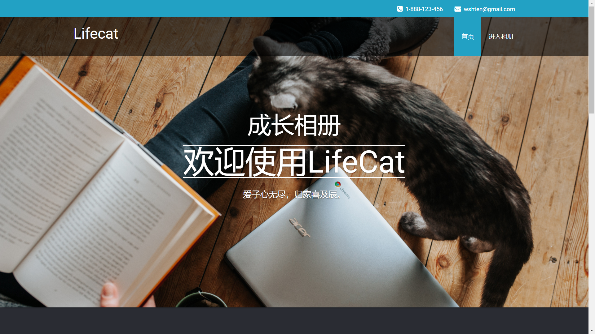

README -- LifeCat
===========================
|title|content|
|:---:|:---:
|desc|智能成长相册网站lifecat
|author|ten
|version|Version 2
|date|2018-05
|brief|基于MVC的Javaweb网站开发
******************************************************************************
  _@访问链接_  
  * [官网主页](http://47.106.11.84)
  
  
  * [相册主页](http://www.lifecat.club:8080/lifecatweb)
  
  
******************************************************************************
  _@使用技术_
  
  |title|content|
  |---|---
  |前端|Html CSS JavaScript
  |前端框架|bootstrap jQuery
  |后端|jsp servlet jdbc
  |后端框架|MVC SOA 
  |设计模式|构建者模式 静态工厂模式 单例模式
  |项目管理|maven
  |单元测试|Junit4
  |日志框架|slf4j
  |数据库|MySql-mariadb
******************************************************************************
  _@Web目录_
  * webapp
    * include
      * home
        * homePage.jsp   // 用户主页body内容部件
      * footer.jsp       // 页脚部件
      * header.jsp       // 页眉部件
      * top.jsp          // 页面标题栏部件
    * WEB-INF
      * imageshow.jsp    // 用户图片展示界面
      * imageshow2.jsp   // 用户分类图片展示界面
      * updiary.jsp      // 上传日记
      * upimage.jsp      // 上传图片
      * userhome.jsp     // 用户主页
    * index.jsp          // 登录/注册界面
******************************************************************************
  _@Java目录_
  * src
    * main.java.com.wang
        * __openfunc__      
        //开放接口层 :接收Android端HTTP请求, 并返回请求结果
        * __doo__           
        //DO包 :对应于数据库表结构, POJO类型
        * __dto__           
        //DTO包 :数据传输对象, 对应逻辑实体，采用构建者模式 或 工厂模式
        * __dao__           
        //DAO协议层 :定义了DAO层的协议, 接口层, 通过静态工厂获取
        * __daoimpl__           
        //DAO实现层 :通过具体实现, 执行数据库交互, 本例中实现了jdbc形式
        * __manager__       
        //Manager层 :DAO层的抽象逻辑操作, Manager层通过静态工厂获取
        * __filter__        
        //Filter过滤器 :对所有请求执行Encoding过滤, 对*.do请求执行Form表单过滤
        * __form__         
        //Form表单验证 :对相应表单执行过滤, 确保格式编码等, 返回Result
        * __exfunc__       
        //外部接口 :通过java call shell方式, 调用本地python脚本, 执行机器学习操作
        * __controller__   
        //Web层 :通过请求内容, 调用相应Service, 转发到Service并获取返回结果
        * __service__       
        //Service层 :执行具体业务逻辑, 并且通过try-catch处理底层抛出异常, 传输DTO到表现层
        * __util__         
        //工具类 :包括时间类, 连接类, 图片写入操作, 主机配置等
    * test.java.com.wang
        * Test          
        //单元测试
*******************************************************************************
  _@应用分层_  
  
   * 上层依赖于下层                               
   * 箭头关系表示可直接依赖  
     
     * 1.__开放接口层__: (openfunc包)  
        * 可直接封装Service方法暴露成RPC接口;  
        * 通过web封装成HTTP接口, 可进行远程调用  
     * 1.__终端显示层__: (web包)  
        * MVC-表现层: 模板渲染层, 主要是JSP渲染  
     * 2.__Web层__: (controller包-ActionServlet)
        * MVC-控制器层: 负责转发请求
        * 对访问控制进行转发, 对各类基本参数校验
     * 3.__Service层__: (service包-<Service>接口)
        * MVC-模型层: 处理抽象业务逻辑， 具体的业务逻辑服务层
        * 对request对象进行处理和转发
     * 4.__Manager层__: (manager包-<Manager>接口)
        * DAO逻辑层, 接收DO对象, 调用DAO层对DO执行具体操作
        * 对service层的下沉处理: 抽象业务逻辑->抽象DAO逻辑
     * 5.__DAO层__: (dao包-<DAO>接口)
        * 对Manager层的下沉处理: 抽象DAO逻辑->具体DAO操作
        * DAOImpl层为具体实现类, 执行具体jdbc操作, 进行数据库交互
     * 6.__外部接口层__: (exfunc包)
        * 调用外部python接口, 实现机器学习的操作
     * 以上调用的返回类型 Result接口
  ******************************************************************************
  _@请求流程分析_
   
******************************************************************************
## 文档目录
  * __[项目规范](standard.md)__ 
  * __[分层架构设计](#分层架构设计)__  
    * [数据库设计](database.md)
    * [数据库SQL](SQL.md)
    * [View层终端显示层设计](#view层终端显示层设计)
    * [Filter层请求过滤器设计](#filter层请求过滤器设计)
    * [Form层表单过滤组件层设计](#form层表单过滤组件层设计 )
    * [Web层请求处理层设计](#web层请求处理层设计)
    * [Service层业务逻辑层设计](#service层业务逻辑层设计)
    * [Manager层通用处理层设计](#manager层)
    * [数据对象模型设计](bean.md)
    * [Utils工具类设计](#utils工具类设计)
    * [Constant常量类设计](#constant常量类设计)
    * [Exfunc外部接口层设计](#exfunc外部接口层设计)
    * [Openfunc开放接口层设计](#openfunc开放接口层设计)
******************************************************************************
### 界面展示


******************************************************************************
### 版本管理
[回到顶部](#readme)  
* __version1.1__  
    * 添加了slf4j-logger  
    * 添加了图片读取功能  
    * 修改了常量类  
* __version1.2__  
    * 添加了智能分类页面-imageshow2.jsp 
    * 修复了bug  
* __version1.3.1__  
    * 单例模式重构MyDate  
    * 构建器模式重构Bean-DTO  
    * 重写了User的hashCode计算,Image的hashCode计算  
    * 覆盖了bean类型的tostring方法  
* __version1.3.2__  
    * 实现了comparable接口，进行日期的比较
    * HOST实现了标记接口  
    * 重构了DAO的SQL查询(单条查询->多条查询)  
* __version1.4__  
    * 设计方法签名  
    * 参数检查  
    * 枚举类改进  
* __version1.5__
    * 增加了Junit测试
* TODO...
******************************************************************************

------------------------------------------------------------------------
------------------------------------------------------------------------
------------------------------------------------------------------------
## 分层架构设计   [回到顶部](#readme)  
------------------------------------------------------------------------
### View层终端显示层设计 
[回到顶部](#readme)  
  * __主页index__  
  
  |功能|方式|
  |---|---
  |登录Form|POST
  |注册Form|POST
  |管理员登录Form|POST 
  |体验Button|GET
  * __用户主页userhome__
  
  |功能|方式|
  |---|---
  |设置个人信息Form|POST
  |获取个人信息|GET
  |上传头像Form|POST
  |获取头像|GET
  |修改密码Form|POST
  |获取部分日记|GET
  |获取部分图片|GET
  * __上传图片upimage__
  
  |功能|方式|
  |---|---
  |上传图片Form|POST
  * __上传日记updiary__
  
  |功能|方式|
  |---|---
  |上传日记Form|POST
  * __图片展示imageshow__
  
  |功能|方式|
  |---|---
  |获取图片|GET
  |修改图片信息Form|POST
  |删除图片Button|GET
  * __图片相册imageshow2__
  
  |功能|方式|
  |---|---
  |获取相册|GET
  |进行分类动作Button|GET
  * __日记展示diaryshow__
  
  |功能|方式|
  |---|---
  |获取日记|GET
  |修改日记信息Form|POST
  |删除日记Button|GET
  * __错误界面error__
  
  |功能|方式|
  |---|---
  |返回界面Button
------------------------------------------------------------------------
### Filter层请求过滤器设计 
[回到顶部](#readme)  
  * 字符过滤器 EncodingFilter
  ```text
  将编码转为utf-8
  ```
  * Form表单验证过滤器 FormFilter
  
  |函数|功能|
  |---|---
  |isNull     |空值检测
  |isTooLong  |最大长度检测
  |isTooShort |最短长度检测
  |isDiff     |异同检测
  * 对POST提交的FORM表单进行过滤
  * 返回结果
    * 验证通过 :提交到请求处理层Web层
    * 验证出错 :返回到请求界面，并设置错误提示信息到Session
------------------------------------------------------------------------
### Form层表单过滤组件层设计 
[回到顶部](#readme)  
  * Interface Verifiable 定义检测内容
    * isNull
    * isTooLong
    * isTooShort
    * isDiff
  * Abstract BaseVerification 定义检测骨架类 
  * FormResult 返回结果
    * boolean success
    * String errormsg  
------------------------------------------------------------------------
### Web层请求处理层设计 
[回到顶部](#readme)  
  * 接收请求
  * 提取URL
  * 从ServiceFoctory获取Service实例
  * 调用Service.execute()
  * 获得返回结果ServcieResult
    * isSuccess==ture  :
      * 根据result.page转发到目标页面
    * isSuccess==false :
      * 返回URL请求界面
      * 设置errormsg到Session
------------------------------------------------------------------------
### Service层业务逻辑层设计 
[回到顶部](#readme)  
   * ServiceFactory 
     * 根据className获取Service接口对象
   * ServiceResult  
     * 1.success :执行是否出错? 
     * 2.errormsg :若出错, 则记录错误信息
     * 3.page :需跳转的界面
   * <Service>接口  
     * ServiceResult execute()
    
   |function|         className|           需操作的表结构|            对应操作请求|               请求类型|
   |---|---|---|---|---
   |管理员登录|       AdminLogin|            admin|                  admin_login.do|            POST
   |管理员注册|       AdminRegister|         admin|                  admin_register.do|         POST
   |用户登录|         UserLogin|             user|                   user_login.do|             POST
   |用户注册|         UserRegister|          user, _property, _icon| user_register.do|          POST
   |用户资料查询|      UserPropertyQuery|     user_property, _icon|   user_property_query.do|    GET
   |用户资料更新|      UserPropertyUpdate|    user_property|          user_property_update.do|   POST
   |用户头像更新|      UserIconUpdate|        user_icon|              user_icon_update.do|       POST
   |用户密码更新|      UserPswUpdate|         user|                   user_password_update.do|   POST
   |图片上传|         ImageUpload|           image|                 image_upload.do|           POST
   |图片删除|         ImageDelete|           image|                  image_delete.do|           GET
   |图片文本内容更新|  ImageTextUpdate|       image|                  image_text_update.do|      POST
   |图片单个查询|      ImageQuery|            image|                  image_query.do|            GET
   |图片全部集合查询|  ImageListQuery|        image|                  image_list_query.do|       GET
   |图片分类集合查询|  ImageClassQuery|       image|                  image_class_query,do|      GET
   |图片分类|         ImageClassify|         image|                  image_classify.do|         GET
   |日记上传|         DiaryUpload|           diary|                  diary_upload.do|           POST
   |日记更新|         DiaryUpdate|           diary|                  diary_update.do|           POST
   |日记数据集获取|    DiaryListQuery|        diary|                  diary_list_query.do|       GET
   |日记删除|         DiaryDelete|           diary|                  diary_delete.do|           GET
------------------------------------------------------------------------
### Manager层通用处理层设计 
[回到顶部](#readme)  

    +-------------------+
    | Manager           |
    +-------------------+
    | AdminManager      | 管理员模块
    |                   |
    | UserManager       | 用户模块
    |                   |
    | ImageManager      | 图片模块
    |                   |
    | DiaryManager      | 日记模块
    +-------------------+
------------------------------------------------------------------------
    ---------------------  方法名↓       操作的DAO↓
------------------------------------------------------------------------
    +-------------------+
    | AdminManager      |
    +-------------------+
    | 注册--插入admin  :             insertAdmin(AdminDO)                      --adminDAO

    | 登录--获取admin  :             queryAdmin()                              --adminDAO
    +-------------------+
------------------------------------------------------------------------
    +-------------------+
    | UserManager       |
    +-------------------+
    | 登录--查询user  :               queryUser()                               --UserDAO

    | 注册--插入user  :               insertUser(UserDO)                        --UserDAO
           插入user_property  :       insertUserProperty(UserPropertyDO)        --UserPropertyDAO
           插入user_icon  :           insertUserIcon(UserIconDO)                --UserIconDAO

    | 资料查询--查询user_property  :   queryUserProperty()                        --UserPropertyDAO
               查询user_icon  :       queryUserIcon()                           --UserIconDAO

    | 密码更新--更新user  :            updateUserPassword(userPassword)          --UserDAO

    | 头像更新--更新user_icon  :        updateUserIcon(usericonDO)                --UserIconDAO

    | 资料更新--更新user_property  :    updateUserProperty(UserPropertyDO)        --UserPropertyDAO
    +-------------------+
------------------------------------------------------------------------
    +-------------------+
    | ImageManager      |
    +-------------------+
    | 图片上传--插入image  :           insertImage()                              --ImageDAO
               插入image_type表  :    insertImageType()                          --ImageTypeDAO

    | 图片删除--从image表删除  :        deleteImage()                              --ImageDAO

    | 图片文本内容更新--更新image  :     updateImage()                              --ImageDAO

    | 图片单个查询--查询image  :         queryImage()                               --ImageDAO

    | 图片全部集合查询--查询image  :     queryImageList()                            --ImageDAO

    | 图片分类集合查询--查询image,image_type  :queryImageClass()                     --ImageDAO,ImageTypeDAO

    | 图片分类--调用外部接口
    +-------------------+
------------------------------------------------------------------------
    +-------------------+
    | DiaryManager      |
    +-------------------+
    | 日记上传--插入diary  :            insertDiary()                               --DiaryDAO

    | 日记更新--更新diary  :            updateDiary()                               --DiaryDAO

    | 日记数据集获取--查询diary  :       queryDiary()                                --DiaryDAO

    | 日记删除--删除diary  :            deleteDiary()                               --DiaryDAO
    +-------------------+

------------------------------------------------------------------------
### DAO层数据持久层设计 
[回到顶部](#readme)  
  * dao            :dao接口层以及骨架类实现
  * daojdbcimpl    :dao接口jdbc实现层
  * daomybatisimpl :dao接口mybatis实现层
------------------------------------------------------------------------    
    +-------------------+
    | Tables_in_lifecat |  <Interface>
    +-------------------+
    | admin             |  AdminDAO
    |                   |
    | user              |  UserDAO
    | user_property     |  UserPropertyDAO
    | user_icon         |  UserIconDAO
    |                   |
    | image             |  ImageDAO
    | image_type        |  ImageTypeDAO
    | image_class       |  ImageClassDAO
    | image_feature     |  ImageFeatureDAO
    |                   |
    | diary             |  DiaryDAO
    +-------------------+
------------------------------------------------------------------------
    AdminDAO          
    //注册--插入admin
    int insertAdmin(AdminDO)
    //登录--获取admin
    AdminDO queryAdmin(adminName)
    //注册--判断用户是否存在
    boolean isAdminExisted(adminName)
------------------------------------------------------------------------
    UserDAO
    //登录--获取user              
     queryUser()
    //注册--插入user             
    insertUser(UserDO)
    //注册--用户是否存在            
    isUserExisted()
    //密码更新--更新user          
    updateUserPassword(userPassword)
    //密码更新--查询原密码          
    queryUserPassword()
------------------------------------------------------------------------
    +-------------------+
    | UserPropertyDAO   |
    +-------------------+
    | 资料查询--查询user_property  :   queryUserProperty()
    | 资料更新--更新查询user_property  :insertUserProperty(UserPropertyDO)
    +-------------------+
------------------------------------------------------------------------
    +-------------------+
    | UserIconDAO       |
    +-------------------+
    | 用户头像更新--插入user_icon       insertUserIcon()
    | 资料查询--查询user_icon          queryUserIcon()
    +-------------------+
------------------------------------------------------------------------
    +-------------------+
    | ImageDAO          |
    +-------------------+
    | 图片上传--插入image              insertImage()
    | 图片删除--删除image              deleteImage()
    | 图片文本内容更新--更新image_text   updateImageText()
    | 图片单个查询--查询image          queryImage(image_name/image_id)
    | 图片全部集合查询--查询image       queryImageList(userId)
    | 图片分类集合查询--查询image       queryImageClass(userId,class_id)
    +-------------------+
------------------------------------------------------------------------
    ImageClassDAO
    //TODO
------------------------------------------------------------------------
    ImageFeatureDAO
    //TODO
------------------------------------------------------------------------
    DiaryDAO
    //日记上传--插入diary             
    void insertDiary(DiaryDO)
    //日记更新--更新diary             
    void updateDiary(DiaryDO)
    //日记数据集获取--查询diaryList    
    queryDiaries()
    //日记删除--删除diary             
    deleteDiary()
------------------------------------------------------------------------

------------------------------------------------------------------------
### Utils工具类设计 
[回到顶部](#readme)  
  * 数据库连接 Connections
  * 图片写入磁盘 ImageWriter
  * 日期时间获取 MyDate
------------------------------------------------------------------------
### Constant常量类设计 
[回到顶部](#readme)  
  * 主机配置信息 HostEnum
  * 数据库配置信息 DBConfigEnum
  * 页面跳转信息 PageEnum
  * 服务器路径配置 PathEnum
------------------------------------------------------------------------
### Exfunc外部接口层设计 
[回到顶部](#readme)  
  * PythonImageServlet
------------------------------------------------------------------------
### Openfunc开放接口层设计 
[回到顶部](#readme)  
  * AndroidImageServlet
------------------------------------------------------------------------
## jsp页面设计
### 登录/注册界面index.jsp
#### FORM-登录 index.jsp/user_login.do
    用户名 userName  
    密码 userPassword  
#### FORM-注册 index.jsp/user_register.do
    注册用户名 rUserName  
    注册密码 rUserPassword1  
    注册密码确认 rUserPassword2 
#### FORM-管理员登录 admin_login.do
    // TODO
#### href-立即体验 
    // TODO
    
### 用户主页 userhome.jsp
#### 
 
####