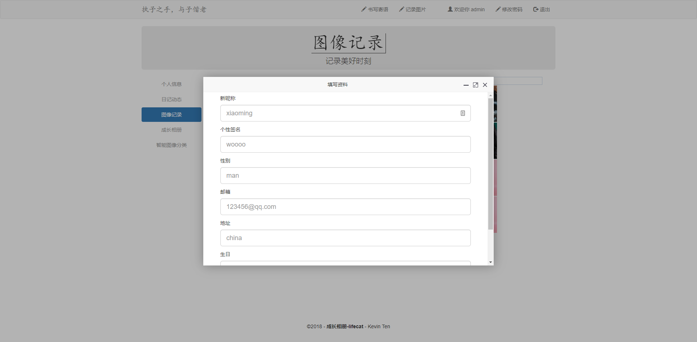

# lifecat-web


 
:cat: :smiley_cat: :kissing_cat:

> 这是一个Javaweb初学的简易项目, 它使用jsp+servlet+mysql的项目架构, 它具有清晰的流程控制和代码注释, 适合初学者的学习阅读, 同时此项目具有说明文档和后续项目可供学习

#### [线上DEMO地址](http://www.lifecat.club:8080/lifecatweb)

点击'立即登录' 用户名:admin 密码:123

### 后续项目线上地址 (建议由浅入深的按顺序学习)

[lifecatweb的SSM框架后台管理系统](http://www.lifecat.club:8080/ssm)

[Vuejs+SpringBoot前后端分离重构lifecatweb(仅部署前端)](http://www.lifecat.club/lifecat)

[Vuejs+SpringBoot前后端分离重构后台管理系统(仅部署前端)](http://www.lifecat.club/admin)

## 项目部署
### 本地部署
``` bash
# Clone下载项目到本地
git clone https://github.com/kevinten10/lifecatweb

# 配置相关文件
进入lifecatweb/src/main/java/com/ten/constant包
1. DataBase.java :修改相应字段为自己的数据库配置  
2. HOST.java     :修改相应字段为数据库IP地址  
    
# 配置数据库
已导出数据库SQL文件, (建议使用navicat)执行lifecatweb/lifecat.sql文件即可生成对应数据库以及DEMO数据

# 配置tomcat
(使用idea)配置tomcat的Artifact时, Application context(即项目名)需要设为"/lifecatweb"

# 启动运行
若报错, 阅读错误信息, 若发现为缺少JSTL错误, 将lifecatweb/jstl-1.2.jar复制到tomcar/lib中
```

### 云服务器部署
```bash
# 部署Javaweb开发环境
# 生成war文件
# 放到对应tomcat目录下
```
云部署相关教程: [centos云服务器部署Javaweb应用](https://blog.csdn.net/wsh596823919/article/details/79717993)

## 项目分析

[若您已部署成功, 想深入理解整体项目的架构以及流程讲解, 点击阅读项目分析教程](Tutorial.md)

## DEMO

 
 
 
 
 
 
 
 
### lifecat相关项目
  [v1 jsp+servlet+mysql实现Javaweb](https://github.com/kevinten10/lifecatweb)    
  [v2 ssm框架实现Javaweb后台管理系统](https://github.com/kevinten10/SSM-lifecat)  
  [v3 前后端分离之SpringBoot实现Java后端开发](https://github.com/kevinten10/springboot-lifecat)  
  [v3 前后端分离之vue实现后台管理系统](https://github.com/kevinten10/Vue-Admin-lifecat)  
  [v3 前后端分离之vue实现仿ins效果web开发](https://github.com/kevinten10/Web-lifecat)  
  
  [ex wechat 微信移动端小程序开发](https://github.com/kevinten10/WeChat-lifecat)  
  [ex hadoop 分布式平台进行数据处理](https://github.com/kevinten10/Hadoop-lifecat)  
  [ex android 相应Android相册应用](https://github.com/kevinten10/Android-lifecat)  
  [ex python 机器学习进行图像智能处理](https://github.com/kevinten10/Python-lifecat)  
