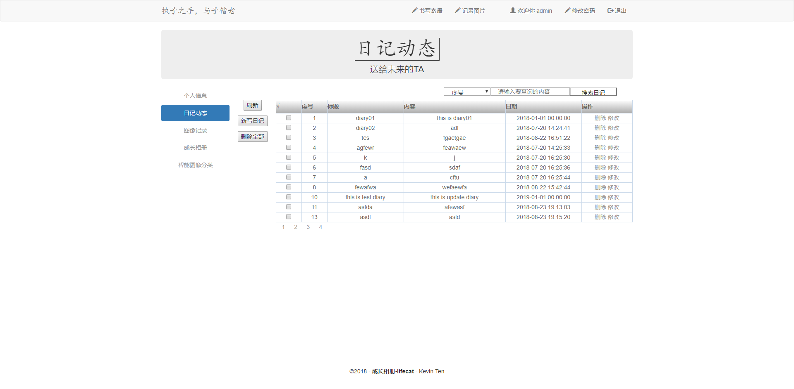

# Lifecat Servlet

> 基于jsp+servlet+jdbc+mysql的javaweb项目. 集成了java基础相关知识. 

## 技术栈

前端：jsp，jstl

后端：servlet，jdbc，mysql

## 编码规范

参考《阿里巴巴Java开发手册》，具体规范请阅读 [doc/Read/*.md](doc/Read)

开发文档请阅读 [doc/Tutorial.md](doc/Tutorial.md)

## 使用
``` bash
# clone
git clone https://github.com/kevinten10/Lifecat-Servlet

# 配置
进入 src/main/java/com.ten.lifecat.servlet.constant 
1. DataBase.java :修改相应字段为自己的数据库配置  
2. HOST.java     :修改相应字段为数据库IP地址  
    
# 配置数据库
已导出数据库SQL文件, (建议使用navicat)执行 doc/lifecat.sql 文件即可生成对应数据库以及DEMO数据

# 配置tomcat
(使用idea)配置tomcat的Artifact时, Application context(即项目名)需要设为"/servlet"

# 启动运行
若报错, 阅读错误信息, 若发现为缺少JSTL错误, 将 doc/jstl-1.2.jar 复制到tomcar/lib中
```

## DEMO

 
 
 
 
 
 
 
 
